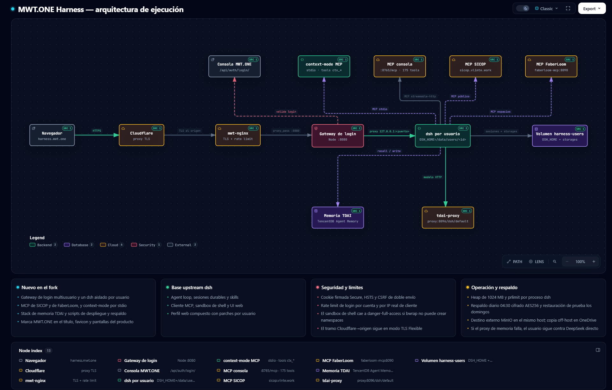
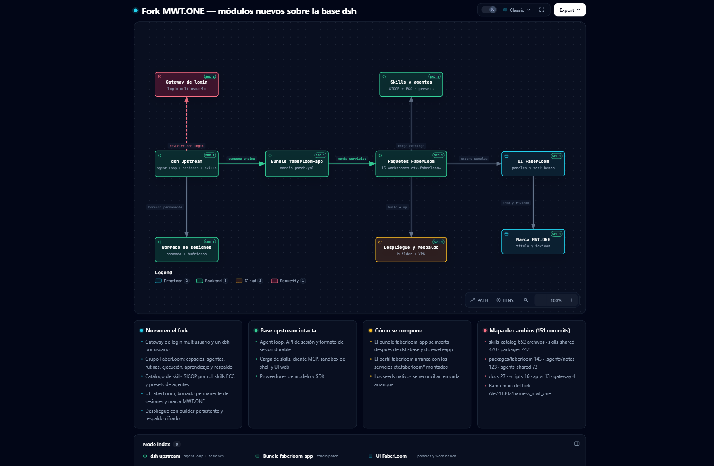
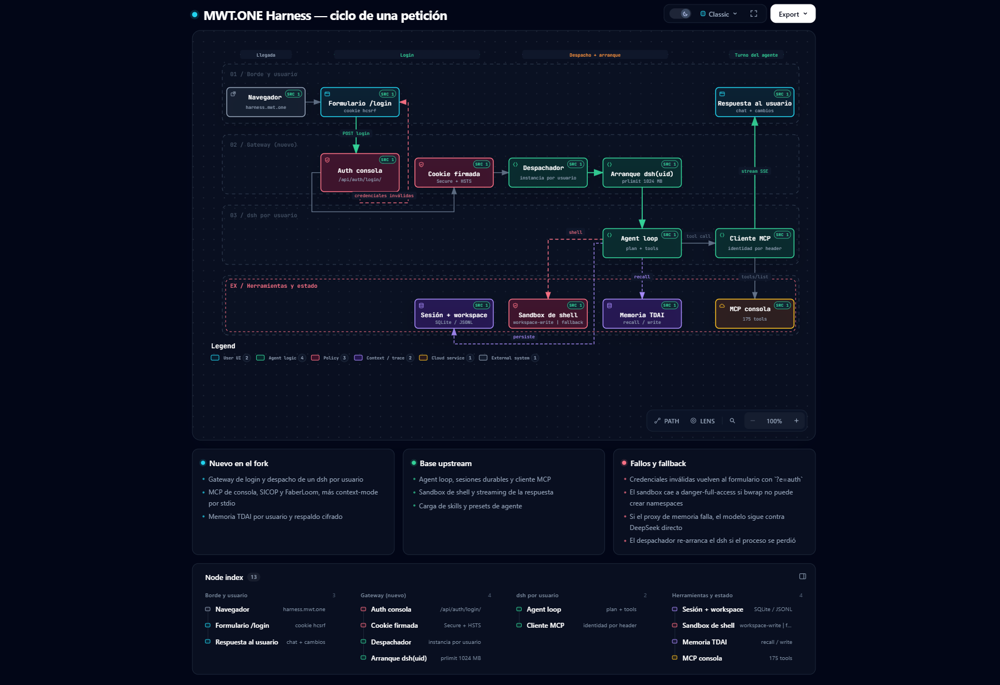

# Diagramas Archify — MWT.ONE Harness

Mapas explorables del fork **MWT.ONE Harness**, generados con Archify v3.0.1 y
validados en navegador real. Cada diagrama es un **HTML autocontenido**: descárgalo
y ábrelo, o sírvelo por HTTP para usar el zoom, el enfoque de nodos y las rutas.

- Interactivo (HTML): `architecture-mwt-one-runtime-20260929-1930/mwt-one-runtime.html` · `architecture-dsh-modulos-20260929-1930/dsh-modulos.html` · `workflow-peticion-mwt-one-20260929-1930/peticion.html`
- Fuente editable (JSON): el `candidate.json` de cada carpeta.
- PDF para compartir (3 páginas): [`preview/mwt-one-diagrams.pdf`](preview/mwt-one-diagrams.pdf)
- Vistas previas PNG: `preview/mwt-one-runtime.png`, `preview/dsh-modulos.png`, `preview/peticion.png`

Para ver el HTML renderizado sin descargar nada, necesita un servidor que lo sirva
como `text/html` (GitHub Pages). Mientras tanto, las vistas previas de abajo se
muestran directamente en GitHub.

---

## 1 · Arquitectura de ejecución MWT.ONE

Navegador → Cloudflare → mwt-nginx → Gateway de login → un `dsh` por usuario,
con MCP consola/SICOP/FaberLoom, `context-mode`, memoria TDAI y volumen persistente.

## 2 · Módulos nuevos vs base upstream

Cómo el bundle `faberloom-app` monta los paquetes FaberLoom sobre el `dsh` upstream,
más skills SICOP/ECC, agentes, UI y despliegue.

## 3 · Ciclo de una petición (workflow)

Login con CSRF → cookie firmada → despacho → arranque `dsh(uid)` → agent loop →
cliente MCP → stream SSE, con las ramas de fallo.

